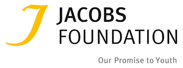
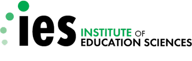
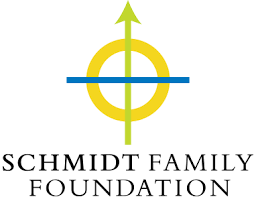

## Creating Datasets for Advancing AI, Education, and Developmental Science

### Virtual Workshop June 23-24, 2022 

The goal of this workshop is to bring together researchers and funders to share and discuss exemplary datasets at the forefront of AI, education, and developmental science.

Free registration [here](googleform). 

# Agenda

Times are listed in PST.

## Day 1 (Thursday, June 23)

- 9:00-9:55am
- 10:00-10:55am
- 11:00-11:55am
- 12:00-12:55pm
- 1:00-1:55pm

## Day 2 (Friday, June 24)

- 9:00-9:55am
- 10:00-10:55am
- 11:00-11:55am
- 12:00-12:55pm
- 1:00-1:55pm

# Speakers

(headshots and brief bios? or just put inline in the agenda?)

# Funders

